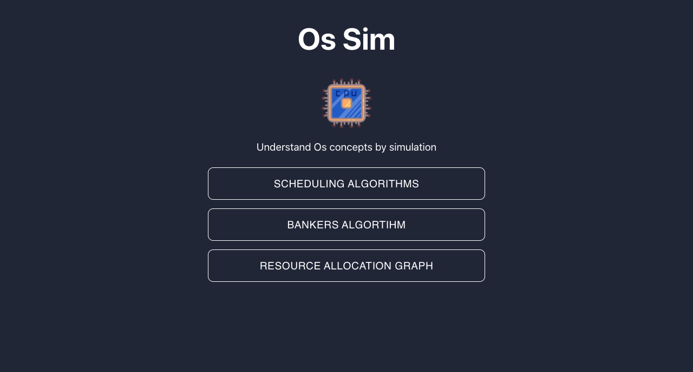
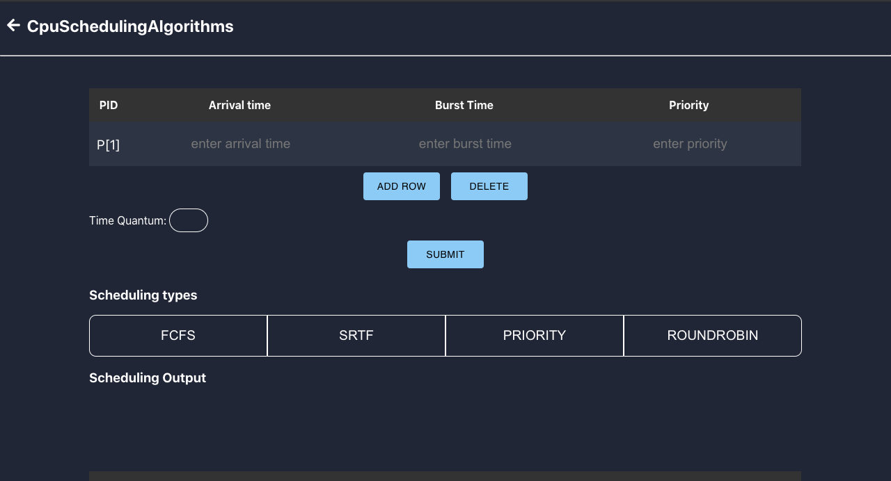
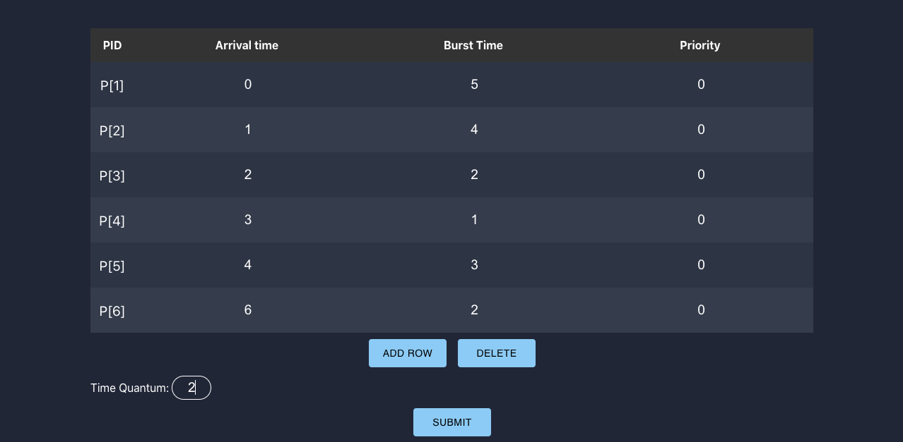
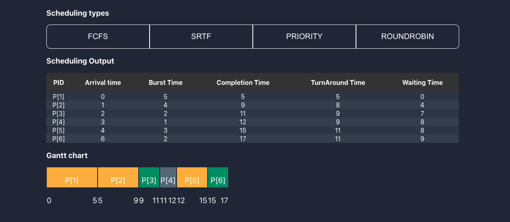
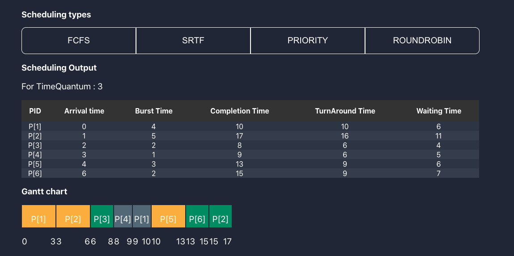

# Cpu scheduling simulator

Cpu scheduling simulator is a project where you can visualize basic scheduling alorithms like:

- FCFS
- SRTF
- Priority
- Round robin

# Tools used
- Rect type-script
- styled-components

# Demo
## Main page

## Scheduling Algorithms
### input table 

### Fcfs

### RoundRobin

# Still working on project
